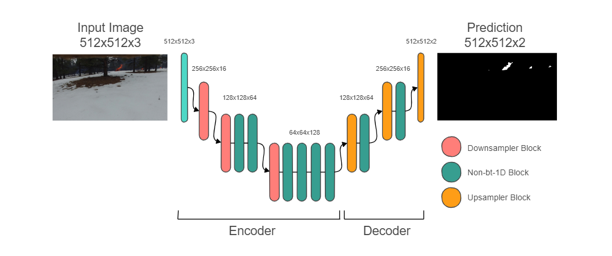

# Aerial Fire Detection with Semantic Segmentation Research
Due to the increased popularity of *Unmanned Aerial Vehicles (UAVs)* for monitoring and predicting potential fire regions, there is a need for models that are able to analyze aerial imagery and run efficiently on devices with limited computing power. 

This project aims to investigate efficient real-time fire detection methods using semantic segmentation and evaluate the effectiveness of different models in identifying and segmenting fires in aerial images. This project also introduces a couple modifications to the original [*ERFNet*](http://www.robesafe.uah.es/personal/eduardo.romera/pdfs/Romera17tits.pdf) model to improve the overall efficiency and segmentation speed.

This project utilizes the Fire Luminosity Airborne-based Machine Learning Evaluation (FLAME) dataset, a widely recognized collection of labeled aerial imagery specifically designed for fire-related analysis, which is available [here](https://ieee-dataport.org/open-access/flame-dataset-aerial-imagery-pile-burn-detection-using-drones-uavs) (you may need to reload the link). 

This project uses the same preprocessing methods as [this notebook](https://github.com/maidacundo/real-time-fire-segmentation-deep-learning/blob/main/Fire%20Segmentation%20Pipeline.ipynb), with different model implementations to test the effectiveness of different models for fire segmentation.

## Setup

### Requirements
Required packages are listed in the `requirements.txt` file.
To install the required packages directly from the file into the notebook, you can run this command in a notebook cell:
```sh
pip install -r requirements.txt
```
You can ensure the required packages have been installed by running this command to display a list of all the installed packages and their versions:
```sh
pip freeze
```

These models were trained and tested on an IPython 7.31.1 kernel with a NVIDIA Tesla P100 PCIe 16 GB GPU using Python 3.9.13 and CUDA version 11.2.1.

### Download dataset
* [FLAME](https://ieee-dataport.org/open-access/flame-dataset-aerial-imagery-pile-burn-detection-using-drones-uavs)
  * Specifically, the images used are from *(9) Images for fire segmentation (Train/Val/Test) Images.zip)* and *(10) Masks annotation for fire segmentation (Train/Val/Test) Masks.zip)* under *'Dataset Files'* and unzip the files into the `./dataset` folder.

## Description
This project improves upon the segmentation speed and efficiency of the original *ERFNet* model by halving the number of `non-bt-1D` layers throughout the model and by changing the `1x3` convolutions within the `non-bt-1D` layers to `1x1` convolutions.



### Metrics
This project evaluates the performance of the models based on Mean Pixel Accuracy (mPA), Mean Intersection over Union (mIoU), Frames per Second (FPS), and Training Time (TT).

### Results
Here are the results collected from the best performance of the models.


## Usage
This project is set up as a IPython Notebook and all the necessary modules and functions are defined within the notebook.

## Repository Structure
    .
    ├── dataset                                         # Directory containing the aerial fire images and the respective segmentation masks.
    ├── Checkpoints                                     # The fire segmentation model checkpoints.
    │   ├── ModifiedERFNet.pth                          # Model trained in notebook.
    │   └── mean-std.npy                                # The mean and standard deviation computed on the train dataset.
    ├── Images                                          # Directory containing images that are shown in the notebook and the README.
    ├── Models                                      # Definitions for the evaluated models.
    │   ├── ERFNet.py                               # Definition of the ERFNet Model.
    │   ├── EfficientSeg.py                         # Definition of the EfficientSeg Model.
    │   ├── Modified_DeepLabv3.py                   # Definition of the Modified DeepLabv3 Model.
    │   ├── Modified_ERFNet.py                      # Definition of the Modified ERFNet Model.
    │   └── UNet.py                                 # Definition of the U-Net Model.
    ├── Aerial_Fire_Notebook.ipynb            # Notebook to train and test the models on.
    ├── README.md                 
    └── requirements.txt                            # File containing all required dependencies and versions

## Google Drive
Here is the Google Drive link that contains the model architectures used, trained models for each architecture, dataset used for project, and notebook with all the necessary code:
https://drive.google.com/drive/folders/1h26dTWys4JA-uOXZtIDLnU_trbQntZXw?usp=drive_link

## References
Li, Mengna, et al. "A Real-time Fire Segmentation Method Based on A Deep Learning Approach." *IFAC-PapersOnLine* 55.6 (2022): 145-150. url: https://www.sciencedirect.com/science/article/pii/S2405896322005055

Romera, Eduardo, et al. "Erfnet: Efficient residual factorized convnet for real-time semantic segmentation." *IEEE Transactions on Intelligent Transportation Systems* 19.1 (2017): 263-272. url: http://www.robesafe.uah.es/personal/eduardo.romera/pdfs/Romera17tits.pdf

Ronneberger, Olaf, Philipp Fischer, and Thomas Brox. "U-net: Convolutional networks for biomedical image segmentation." *Medical Image Computing and Computer-Assisted Intervention–MICCAI 2015: 18th International Conference, Munich, Germany, October 5-9, 2015, Proceedings, Part III* 18. Springer International Publishing, 2015. url: https://arxiv.org/abs/1505.04597

Yesilkaynak, Vahit Bugra, Yusuf H. Sahin, and Gozde Unal. "Efficientseg: An efficient semantic segmentation network." *arXiv preprint arXiv:2009.06469* (2020). url: https://arxiv.org/abs/2009.06469

